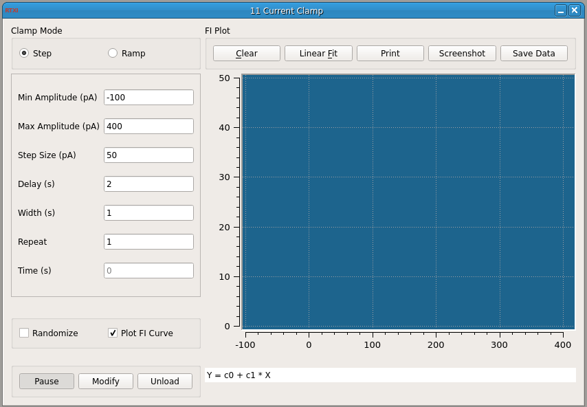

###Current Clamp

**Requirements:** GSL, Qwt, SpikeDetect plugin, Plot helper classes, Running Statistics class (included)  
**Limitations:** None  



<!--start-->
This plugin allows you to deliver a protocol for current step or current ramp inputs. You can randomize the order of amplitudes used and repeat the entire protocol a certain number of times. For current step inputs, you can also choose to plot the f-I curve as it is generated. For each complete cycle through all the command currents, the plot symbol will change. The firing rate is computed by taking the reciprocal of the average ISI detected during a command input. Plotting the f-I curve will also enable buttons that allow you to perform a linear regression, print the plot, save a screenshot in SVG format, or save the data points. Only the data points generated in the last run are saved and you can append them to an existing file. The linear regression is performed on ALL data points in the plot, not just those generated in the last run. If you add points to the plot and perform another regression, you will get another line. Zoom in on the plot by clicking and dragging with the mouse. Middle click to go back to the previous zoom. All the data points and coefficients and statistics for each regression are printed to the terminal.
<!--end-->

####Usage/Dependencies/Installation:

The include folder (containing the ScatterPlot, IncrementalPlot, ScrollBar, ScrollZoomer, and RunningStat classes) should be located on the same directory level as CClamp3. The [GPL GSL library](http://www.gnu.org/software/gsl/) is used to perform a linear regression on data points. If you installed RTXI from a Live CD, you should already have GSL. If you did a manual installation of RTXI, you should install GSL using your Linux distribution’s package manager. In Ubuntu, the package manager can be found in the toolbar under Administration. Alternatively, you can install via the apt repository by running:

````
$ sudo apt-get install libgsl0-dev
````

The f-I scatterplot is based on [LGPL Qwt widgets](http://qwt.sourceforge.net/). Follow the instructions in the manual installation notes to correctly install Qwt for RTXI.

####Input Channels
1. input(0) – “Spike State” : received from SpikeDetect plugin. A value of 1 indicates the spike time.

####Output Channels
2. output(0) – “Command” : Step (or ramp) current command in amperes. Connect to the amplifer external signal input.

####Parameters
1. Minimum Amplitude (pA): Minimum amplitude of current step/ramp
2. Maximum Amplitude (pA): Maximum amplitude of current step/ramp
3. Step Size (pA): Step size to use between minimum and maximum current amplitudes
4. Delay (s): Delay between the end of one command input and the start of the next
5. Width (s): Width of a command input
6. Repeat: How many times to repeat the entire protocol (you will get a scatterplot of data points)

####Options
1. Randomize – Randomize the amplitudes within the protocol. Each repetition of the protocol is randomized within that cycle.
2. Plot FI Curve – Check to show/hide the FI Plot, and plot the data points as they are generated.
